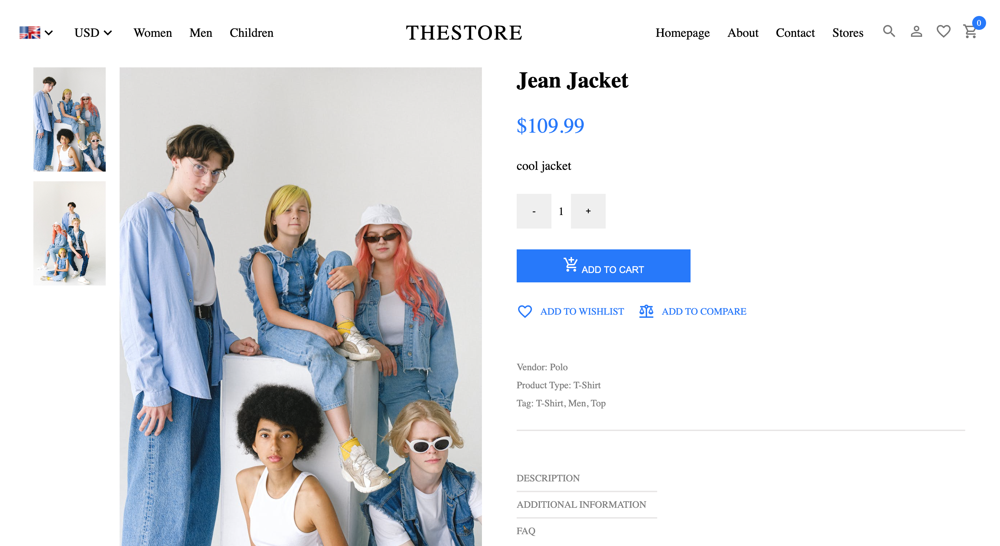
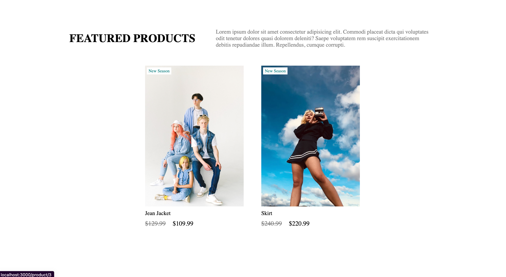

# Headless E-Commerce App

## Table of Contents
* General Information
* Technologies Used
* Features
* Screenshots
* Installation and Setup Instructions
* Usage
* Project Status
* Room for Improvement
* Acknowledgements
* Contact

## General Information
The Headless E-Commerce App is a modern e-commerce solution that utilizes a headless architecture to separate the front-end and back-end. This project integrates technologies such as ReactJS, Strapi CMS, Stripe for secure payment processing, Redux for state management, and various other tools.

### Purpose of this Project
The aim of this project is to create a scalable and flexible e-commerce platform that provides a seamless shopping experience for users.

## Technologies Used
* ReactJS
* Redux
* Strapi
* Stripe
* JavaScript
* HTML
* CSS
* Axios
* React Router

## Features
* Product catalog with categories
* Shopping cart functionality
* Secure payment processing with Stripe
* Search and filter products

## Screenshots
Home Page 

Single Item Page

Featured Products

Item Categories

## Installation and Setup Instructions
To set up and run the Headless E-Commerce App on your local machine, follow these steps:

1. Clone this repository.
2. Install the required dependencies:
`cd client/api`
`npm install`
3. Configure Strapi CMS:
- Create product models, configure APIs, and set up authentication as needed.
4. Configure Stripe:
- Set up Stripe API keys and configure payment endpoints in the backend.
5. Start the frontend and backend servers:
`cd client/api`
`npm start`
6. Visit the app at `http://localhost:3000/`.

## Usage
### Product Catalog
* Browse and search for products in the catalog.

### Shopping Cart
* Add products to your cart and manage cart items.

### Secure Checkout
* Complete secure checkout using Stripe for payment processing.

## Project Status
The Headless E-Commerce App is currently in a completed state.

## Room for Improvement
* Implement email notifications for order updates.
* Enhance the admin dashboard in Strapi for product management.

## Acknowledgements
Special thanks to the Strapi and Stripe development communities for their support and resources.

## Contact
Created by Abeer Ahmed [LinkedIn profile](https://www.linkedin.com/in/abeerwebdev/) - feel free to contact me.

